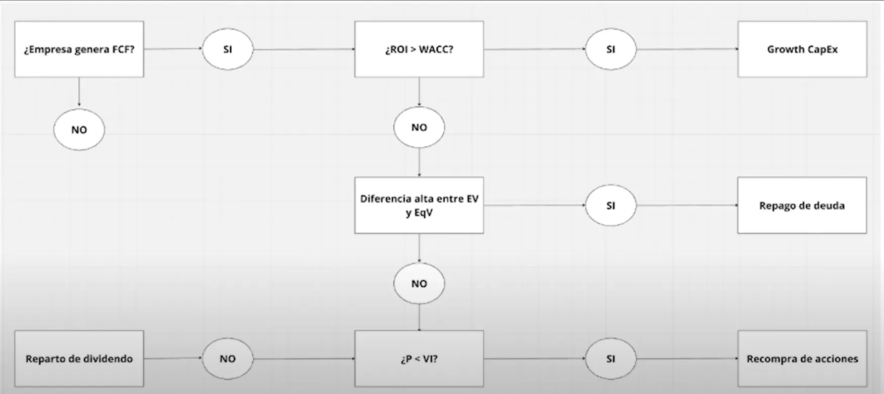

import FooterLinkGestionCapital  from '../../../components/FooterLinkGestionCapital.astro';

La **gestión del capital** es otro aspecto clave en el análisis de una compañía. Ya hemos mencionado dónde una empresa puede gastar su capital, pero ahora lo que debemos comprender es **cómo** lo gestiona y si lo hace de manera que maximice el valor para los accionistas.

### ¿Cómo se gestiona el capital en una empresa?

Las empresas tienen varias formas de emplear su capital, y no todas son igual de beneficiosas para los accionistas. Algunas decisiones pueden generar más valor que otras. A continuación, te presentamos una escala de menor a mayor valor para los accionistas

1. 🔻**Acumular caja**: Algunas empresas optan por guardar su capital en caja en lugar de reinvertirlo. Esto puede ser útil en momentos de incertidumbre económica, pero a largo plazo, mantener demasiada caja sin un uso claro puede ser una señal de que la empresa no está aprovechando al máximo sus recursos.
 
2. **Pagar dividendos**: Aunque a muchos accionistas les encantan los dividendos, no siempre es la mejor opción para crear valor a largo plazo. Cuando una empresa se endeuda para pagar dividendos, puede ser señal de una gestión de capital ineficiente.

3. **Amortización de Deuda**

4. **Recompras de acciones**: Las recompras de acciones son una forma de reducir el número de acciones en circulación, lo que aumenta el valor de las acciones restantes. Esta puede ser una buena estrategia si la empresa cree que sus acciones están infravaloradas.

5. 🚀**Reinversión en el negocio**: El mejor uso del capital, en muchos casos, es **reinvestir en el propio negocio**. Esto puede incluir nuevas adquisiciones, expansión a nuevos mercados, investigación y desarrollo, o mejoras en infraestructuras. Las empresas que logran una alta tasa de reinversión en áreas de crecimiento suelen generar más valor para los accionistas.

### Evaluación del equipo gestor

Un punto crucial al analizar la gestión del capital es entender las **decisiones estratégicas del equipo directivo**. Los gestores que simplemente **acumulan caja** o **pagan dividendos** sin generar nuevas oportunidades de crecimiento podrían estar dirigiendo la empresa de una manera que no maximiza el valor a largo plazo.

Por el contrario, un equipo gestor que se enfoca en **recompras de acciones** cuando estas están infravaloradas, o en **reinvención y expansión** del negocio, demuestra una estrategia más sólida de creación de valor.

### Conclusión

:::note[Importante]
Es importante evaluar cómo se gasta el capital de la compañía, ya que esto refleja la **visión a largo plazo** del equipo gestor. Aquellas empresas que busquen **maximizar el valor para el accionista** mediante inversiones inteligentes en su negocio o recompras de acciones bien fundamentadas son, por lo general, mejores candidatas para la inversión a largo plazo.
:::

---
<FooterLinkGestionCapital />
---
