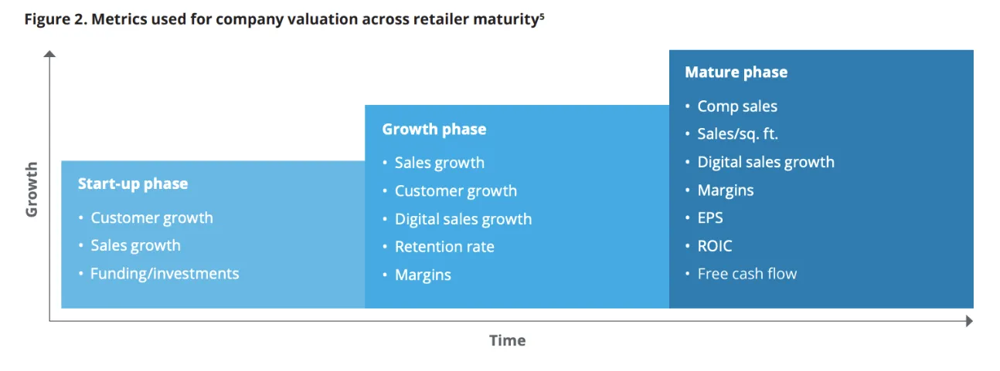

Este módulo es muy interesante, ya que aquí vais a empezar a encontrar oportunidades. Por ejemplo, **Louis Vuitton** pertenece a este sector y entre hoy y mañana ya os llevaréis dos ideas interesantes para evaluar en vuestra cartera.

## Valuación de Retail "Premium"

| Métrica       | Rango estimado |
| ------------- | -------------- |
| **EV/EBITDA** | 10-14x         |
| **EV/EBIT**   | 12-16x         |
| **PER**       | 15x + 30x      |
| **EV/FCF**    | 15 + 30x       |

---

### Precio óptimo

| Métrica    | Valor óptimo |
| ---------- | ------------ |
| **EBITDA** | 10-12x       |
| **PER**    | 16x          |
| **EV/FCF** | 16x          |

---

### Factores que afectan el rango de múltiplos

| Factores que influyen en el rango de múltiplos        |
| ----------------------------------------------------- |
| LFL y Crecimiento potencial del negocio               |
| MOAT de la compañía                                   |
| Márgenes de beneficio                                 |
| ROIC                                                  |
| Nivel de deuda (+ de 4-5x deuda neta/EBITDA penaliza) |

## Valuación de Retail "Medio"

| Métrica       | Rango estimado |
| ------------- | -------------- |
| **EV/EBITDA** | 6-12x          |
| **EV/EBIT**   | 8-14x          |
| **PER**       | 8-15x          |
| **EV/FCF**    | 15-20x         |

---

### Precio óptimo

| Métrica    | Valor óptimo |
| ---------- | ------------ |
| **EBITDA** | 5x           |
| **PER**    | 10x          |
| **EV/FCF** | 11-12x       |

---

### Factores que afectan el rango de múltiplos

| Factores que influyen en el rango de múltiplos        |
| ----------------------------------------------------- |
| LFL y Crecimiento potencial del negocio               |
| MOAT de la compañía                                   |
| Márgenes de beneficio                                 |
| ROIC                                                  |
| Nivel de deuda (+ de 4-5x deuda neta/EBITDA penaliza) |

---

## Invertir en empresas retail

Las empresas de retail, también conocidas como empresas minoristas, se diferencian de las empresas mayoristas porque **venden directamente a los consumidores finales**. Este tipo de empresas incluyen una gran variedad de negocios, desde **Amazon** en su tienda online hasta **Inditex** o **Carrefour**, que son supermercados.

- **B2C (Business to Consumer)**: El negocio vende directamente al cliente final.
  
### Ciclicidad y estacionalidad
- **Ciclicidad baja-media**: Depende del tipo de retail y sector.
- **Estacionalidad**: Algunos negocios presentan picos de ventas en verano o en Navidad. Ejemplos como Carrefour, donde los turistas en verano y las celebraciones en Navidad pueden incrementar las ventas.

### Ejemplos de empresas retail
- **Amazon** (tienda online)
- **Inditex** (moda)
- **Carrefour** (supermercado)
  
---

## Formatos y estrategias

Las empresas minoristas pueden adoptar diferentes formatos:

- **Tiendas físicas**
- **Supermercados**
- **Tiendas especializadas**
- **Grandes almacenes**
- **Marketplaces digitales**
- **Estrategia Omnicanal**: Combina tiendas físicas y online. Ejemplo: **Montcler**, que distribuye productos directos al cliente, pero también vende a través de intermediarios o tiendas multimarca.

### Competencia en precios
El sector minorista es muy competitivo en cuanto a precios, especialmente en supermercados. Esto afecta los márgenes de ganancia, sobre todo si no cuentan con marcas blancas.

### Experiencia del cliente
En el sector retail, la **experiencia del cliente** es fundamental. Una buena experiencia puede ser el **factor diferenciador** dentro de un mercado tan competitivo.

---

## Tendencias del mercado y disrupciones

Las empresas retail deben adaptarse a **tendencias cambiantes** y a las preferencias de los consumidores. Ejemplo: La industria alimenticia y las modas en el consumo saludable.

Un ejemplo de disrupción negativa sería **Gokú**, una compañía de ropa online sin ventajas competitivas, cuya mala gestión terminó en desastre.

---

## Ejemplos de empresas retail por sectores

| **Sector**               | **Ejemplos**                                    |
| ------------------------ | ----------------------------------------------- |
| **Restaurantes**         | McDonalds, Burger King, Domino's Pizza, Wendy's |
| **Moda**                 | Inditex, H&M, Moncler, Gucci                    |
| **Construcción y hogar** | Home Depot, Maisons du Monde, Kingfisher        |
| **Automóviles**          | AutoZone, O'Reilly, Boy Group                   |
| **Supermercados**        | Walmart, Costco, Carrefour, Aldi, Lidl          |
| **Parafarmacias**        | Walgreens, Boots                                |
| **Retail online**        | Amazon, Alibaba, JD.com                         |

---

## Conclusiones

- El **sector retail** es amplio y competitivo, con negocios que van desde moda hasta supermercados o tiendas online.
- Las empresas deben adaptarse a las **preferencias del cliente** y ser capaces de competir en **precios y experiencia**.
- Existen oportunidades interesantes en este sector, pero es crucial comprender bien las dinámicas de cada subsector antes de invertir.

# Principales métricas y aspectos de valoración a tener en cuenta en empresas retail

Las compañías retail, o de venta minorista, pueden clasificarse en diferentes fases de evolución, cada una con sus propios riesgos y oportunidades. A continuación, repasamos las fases, las principales métricas, y los aspectos clave que afectan su valoración.

## Fases de una compañía retail

1. **Primera fase: crecimiento de clientes y ventas, pero no rentabilidad**
    - **Enfoque**: Aquí el mercado no se preocupa por la rentabilidad. Solo se fija en el crecimiento de clientes, las ventas y la capacidad de financiación. 
    - **Consejo**: Estas compañías no rentables presentan alto riesgo. A menos que seáis expertos en predecir su futuro, se aconseja **no invertir en esta fase**.
    
2. **Segunda fase: fase de crecimiento**
    - **Enfoque**: Se valora el crecimiento de ventas, la captación de clientes, ventas digitales y la tasa de retención de clientes.
    - **Ejemplo**: **Lululemon** se encuentra en esta fase, compitiendo con gigantes como **Nike** y **Adidas** en un nicho específico.
    - **Riesgo**: Aunque las empresas en esta fase pueden parecer prometedoras, es importante evaluar si el crecimiento es sostenible o simplemente una **moda** pasajera.

3. **Tercera fase: madurez**
    - **Enfoque**: Se valoran las **ventas comparables** (like-for-likes), ventas digitales, márgenes, ROIC y free cash flow.
    - **Ejemplo**: **Nike**, una empresa ya madura con métricas estables y predecibles.
    - **Consejo**: Invertir en compañías que ya están en esta fase es más seguro, ya que puedes valorar estos indicadores y basar tu análisis en datos concretos y estables.

---

## Principales métricas en empresas retail

### 1. **Ventas comparables (Like-for-likes)**
- **Descripción**: El crecimiento orgánico de las tiendas que ya están operando. Evalúa si las tiendas existentes están generando más ingresos sin contar las aperturas o adquisiciones de nuevas tiendas.
- **Importancia**: Las ventas comparables son clave para ver la **salud real** del negocio. Si abres nuevas tiendas pero las existentes no crecen, es una señal negativa.
  
### 2. **Ventas físicas vs ventas online**
- **Tendencia**: Las **ventas online** crecen a tasas mucho mayores que las ventas físicas, que están **estancadas** o crecen muy poco.
- **Consejo**: Es recomendable invertir en empresas con una fuerte **exposición online**, ya que estas tienen mayor potencial de crecimiento.

### 3. **Márgenes operativos**
- **Rango habitual**:
  - **Restaurantes y bares**: 10-20%
  - **Supermercados**: 3-7%
  - **Moda y complementos**: 10-20% (mayores en lujo)
  
### 4. **ROIC (Return on Invested Capital)**
- **Descripción**: Medida de la eficiencia de la empresa para generar beneficios a partir del capital invertido.
- **Importancia**: Las empresas retail suelen tener **bajas necesidades de capital**, lo que puede llevar a **ROIC altos**. Por ejemplo, los supermercados tienen infraestructura simple y márgenes de capex bajos.

### 5. **Deuda**
- **Consejo**: Evitar empresas retail con altos niveles de deuda. Este sector tiene **costes fijos elevados**, como alquileres y personal, lo que las hace más vulnerables en momentos de crisis.
- **Riesgo del working capital negativo**: Algunas empresas retail operan con working capital negativo, lo que significa que **financian su ciclo operativo a través de proveedores**. Si las ventas caen, podrían enfrentarse a problemas graves de liquidez.

### 6. **Evolución de márgenes netos y ROIC**
- **Márgenes en función del sector**:
  - Supermercados: márgenes bajos (4-7%)
  - Moda y complementos (10-20%)
  - Restaurantes y bares (10-20%)
  
---

## Factores clave de disrupción en retail

### 1. **Internet y e-commerce**
- **Impacto disruptivo**: Internet ha cambiado radicalmente el sector retail, llevando a muchas compañías tradicionales al fracaso. Las empresas que no han podido adaptarse al **e-commerce** han sufrido grandes pérdidas.
- **Ejemplo**: **Sears Holdings** fue una compañía retail que colapsó a pesar de tener un gran valor en sus activos inmobiliarios. La empresa no pudo adaptarse al comercio online y, finalmente, quebró.

### 2. **Estrategia omnicanal**
- **Descripción**: Una estrategia omnicanal implica que la empresa vende tanto en tiendas físicas como online.
- **Ejemplo**: **Inditex** y **Nike** combinan tanto tiendas físicas como online. Esto les da la flexibilidad de captar clientes en múltiples canales.

---

## Principales múltiplos de valoración

Los múltiplos de valoración dependen del tipo de empresa retail y su fase de madurez. Las compañías **retail premium** (ej. Louis Vuitton, Hermès) cotizan a múltiplos más altos debido a su solidez y crecimiento. Los múltiplos típicos incluyen:

| **Métrica**   | **Rango habitual** |
| ------------- | ------------------ |
| **EV/EBITDA** | 10x-16x            |
| **EV/EBIT**   | 16x-25x            |
| **PER**       | 15x-25x            |
| **EV/FCF**    | 15x-25x            |

---

## Conclusión

Invertir en el sector retail requiere entender bien la fase en la que se encuentra la empresa, así como las métricas clave como las **ventas comparables**, los márgenes, el **ROIC** y los niveles de deuda. Las oportunidades suelen ser más seguras en empresas maduras, pero también pueden encontrarse oportunidades en compañías en fase de crecimiento que estén bien gestionadas.

# Ejemplo de Valoración: Moncler

Moncler es una empresa italiana del sector moda de lujo especializada en **prendas de abrigo**. Se ha diversificado en otros segmentos y ha logrado una **cuota de mercado significativa** en su nicho. Esta valoración ejemplifica cómo analizar una empresa de este tipo utilizando proyecciones y múltiplos clave.

---

## 1. Crecimiento Histórico

- **Crecimiento de ventas**: El negocio ha mostrado un fuerte crecimiento, salvo en 2020 debido a la pandemia, ya que los clientes estaban confinados y no compraban productos de lujo.
  
  | Año  | Crecimiento de ventas |
  | ---- | --------------------- |
  | 2017 | 17%                   |
  | 2018 | 18%                   |
  | 2019 | 15%                   |
  | 2020 | -11%                  |
  | 2021 | 25%                   |
  | 2022 | 20%                   |

  Moncler ha mantenido **márgenes EBITDA** en torno al **35%** y ha conseguido una expansión significativa de beneficios.

---

## 2. Márgenes y Endeudamiento

- **Márgenes EBITDA**: Están alrededor del **30-35%**, mostrando la alta eficiencia de la empresa en términos operativos.
  
  | Año  | Margen EBITDA |
  | ---- | ------------- |
  | 2017 | 30%           |
  | 2018 | 31%           |
  | 2019 | 33%           |
  | 2020 | 35%           |
  | 2021 | 36%           |

- **Deuda**: Moncler es una **compañía con poca deuda**. Se ha endeudado ligeramente con la adquisición de **Stone Island**, pero se considera justificado.

---

## 3. Impuestos y Working Capital

- **Tasa Impositiva**: Al estar en Italia, la compañía tiene una tasa impositiva en torno al **29-33%**.
- **Working Capital**: Moncler tiene un **working capital estable**, con variaciones mínimas. Su crecimiento y operación están bien gestionados.
  - Años como 2020 (por la pandemia) distorsionaron un poco la media debido a inventarios más altos.

---

## 4. Proyección de Crecimiento

Es importante ajustar el crecimiento futuro de manera conservadora. Se espera que Moncler crezca a tasas más bajas en los próximos años, comparado con los años de auge.

| Año  | Crecimiento Estimado |
| ---- | -------------------- |
| 2023 | 3.4%                 |
| 2024 | 8%                   |
| 2025 | 10%                  |

---

## 5. Valoración del Negocio

- **PER (Price to Earnings Ratio)**: Históricamente, Moncler ha cotizado a un PER de 27x. Sin embargo, se proyecta de manera conservadora a 25x para los próximos años.

| Métrica       | Múltiplo |
| ------------- | -------- |
| **PER**       | 25x      |
| **EV/EBITDA** | 14x      |
| **EV/FCF**    | 17x      |

---

## 6. TIR (Tasa Interna de Retorno)

La TIR estimada para Moncler es del **13-15%**, lo cual es razonable considerando que su múltiplo ha sido históricamente alto. Se proyecta un **múltiplo de 25x** en los próximos años, y si se ajusta el crecimiento para 2025, la TIR podría acercarse a **15%**.

---

## 7. Evaluación Final

Moncler es una **compañía sólida** con una proyección conservadora de crecimiento. Aunque es posible que no crezca a tasas tan altas como en años anteriores, sigue siendo una **opción atractiva** dentro del sector de lujo. Algunas de sus fortalezas incluyen:

- **Márgenes operativos altos** (30-35%).
- **Bajo nivel de deuda**, con solo una leve carga por la adquisición de Stone Island.
- **Alta eficiencia operativa** y un ROI elevado (en torno al 30%).

El precio objetivo se estima en función del **PER**, **EV/EBITDA**, y **EV/FCF**, lo que refleja su posición premium en el sector de lujo.

---

## 8. Consideraciones finales

Aunque Moncler ha mostrado **crecimiento constante** y ha mantenido márgenes fuertes, hay que considerar los posibles riesgos derivados de una **corrección en los múltiplos** o cambios en la demanda de productos de lujo debido a la **ciclicidad del mercado**. No obstante, su nicho exclusivo y **fuerte posicionamiento** la hacen una **apuesta sólida** en el sector retail de lujo.

---

El gráfico muestra las **principales métricas utilizadas para la valoración de empresas del sector retail** a lo largo de sus diferentes fases de madurez. A continuación, explicamos cada fase y las métricas claves que la representan:

---

### 1. **Start-up phase (Fase de inicio)**
Esta es la fase más temprana de una empresa retail. En esta etapa, el negocio está empezando a crecer, lo que significa que aún no se espera rentabilidad, sino un crecimiento acelerado. Las métricas clave en esta fase son:

- **Crecimiento de clientes (Customer growth)**: Indica cuántos nuevos clientes está atrayendo la empresa. Una base de clientes en expansión sugiere una demanda creciente para los productos o servicios.
- **Crecimiento de ventas (Sales growth)**: La empresa busca aumentar sus ingresos a través de nuevas ventas. No importa tanto la rentabilidad en esta etapa, sino cuánto puede incrementar sus ventas.
- **Financiación/Inversiones (Funding/investments)**: Mide la capacidad de la empresa para atraer capital de inversores o deuda para financiar su crecimiento inicial.

💡 **Comentario**: Las empresas en esta fase son riesgosas porque están más enfocadas en crecer que en generar ganancias. Los inversores valoran la capacidad de atraer clientes y ventas rápidamente.

---

### 2. **Growth phase (Fase de crecimiento)**
En esta etapa, la empresa ya ha demostrado que tiene un modelo de negocio sólido y ahora busca crecer de forma más estructurada. Las métricas clave en esta fase son:

- **Crecimiento de ventas (Sales growth)**: Las ventas deben mantenerse estables, reflejando un crecimiento más sostenible.
- **Crecimiento de clientes (Customer growth)**: La expansión de la base de clientes sigue siendo crucial, pero también se enfoca en retener a los clientes actuales.
- **Crecimiento de ventas digitales (Digital sales growth)**: Las ventas online son cada vez más importantes a medida que la tecnología avanza.
- **Tasa de retención (Retention rate)**: Mide cuántos clientes repiten la compra, lo que indica lealtad hacia la empresa.
- **Márgenes (Margins)**: La empresa comienza a mostrar la rentabilidad real de su modelo de negocio.

💡 **Comentario**: En esta fase, la empresa se está consolidando. Se enfoca no solo en crecer, sino en hacerlo de manera eficiente y rentable.

---

### 3. **Mature phase (Fase madura)**
En esta fase, la empresa retail ya está consolidada en el mercado. No se espera un crecimiento explosivo, pero sí estabilidad y generación de valor para los accionistas. Las métricas clave aquí son:

- **Ventas comparables (Comp sales)**: Mide el crecimiento entre periodos sin contar nuevas aperturas, es decir, el crecimiento en las tiendas ya existentes.
- **Ventas por metro cuadrado (Sales/sq.ft.)**: Indica la eficiencia de las tiendas físicas en generar ventas.
- **Crecimiento de ventas digitales (Digital sales growth)**: Aunque en la fase madura, las ventas online siguen siendo clave para la adaptabilidad del negocio.
- **Márgenes (Margins)**: Reflejan la rentabilidad del negocio.
- **Beneficio por acción (EPS)**: Mide las ganancias que obtiene cada acción de la empresa, un indicador clave para los inversores.
- **ROIC (Return on Invested Capital)**: Mide la eficiencia de la empresa en utilizar el capital invertido para generar beneficios.
- **Flujo de caja libre (Free cash flow)**: Refleja el dinero disponible después de pagar todos los gastos operativos y de capital.

💡 **Comentario**: En esta fase, el enfoque está en mantener estabilidad, rentabilidad y generar valor para los accionistas. Las empresas maduras no suelen crecer rápido, pero son inversiones más seguras y rentables a largo plazo.

---

## Resumen
El gráfico refleja cómo cambian las métricas de valoración de una empresa retail a lo largo de su ciclo de vida:

1. **Start-up phase**: El foco está en el crecimiento de clientes y ventas.
2. **Growth phase**: La empresa debe demostrar capacidad de retención de clientes, crecimiento digital y eficiencia operativa.
3. **Mature phase**: Las métricas se centran en la rentabilidad, el flujo de caja y la generación de valor sostenible.

Cada fase presenta distintos niveles de riesgo y rentabilidad potencial para los inversores, por lo que es clave identificar en qué fase se encuentra una empresa para hacer una valoración adecuada.

